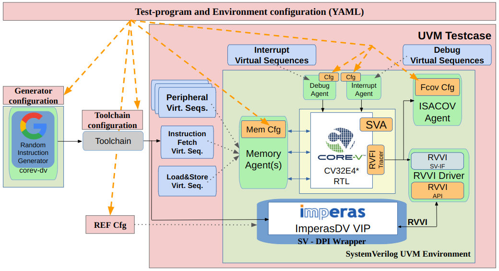

# Verification Environment for the CV32E40X CORE-V processor core.

## Directories:
- **bsp**:   the "board support package" for test-programs compiled/assembled/linked for the CV32E40X.
- **env**:   the UVM environment class and its associated infrastrucutre.
- **sim**:   directory where you run the simulations.
- **fv**:    directory where you run formal verification.
- **tb**:    the Testbench module that instanitates the core.
- **tests**: this is where all the testcases are.

There are README files in each directory with additional information.

